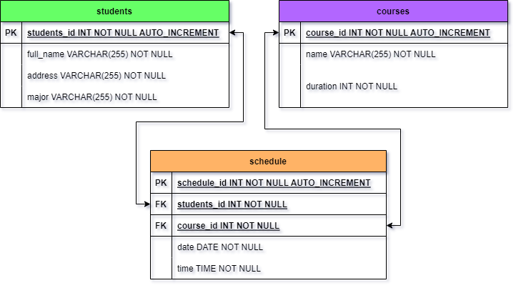
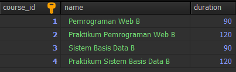
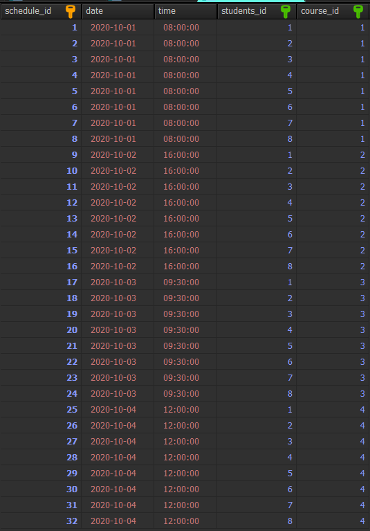
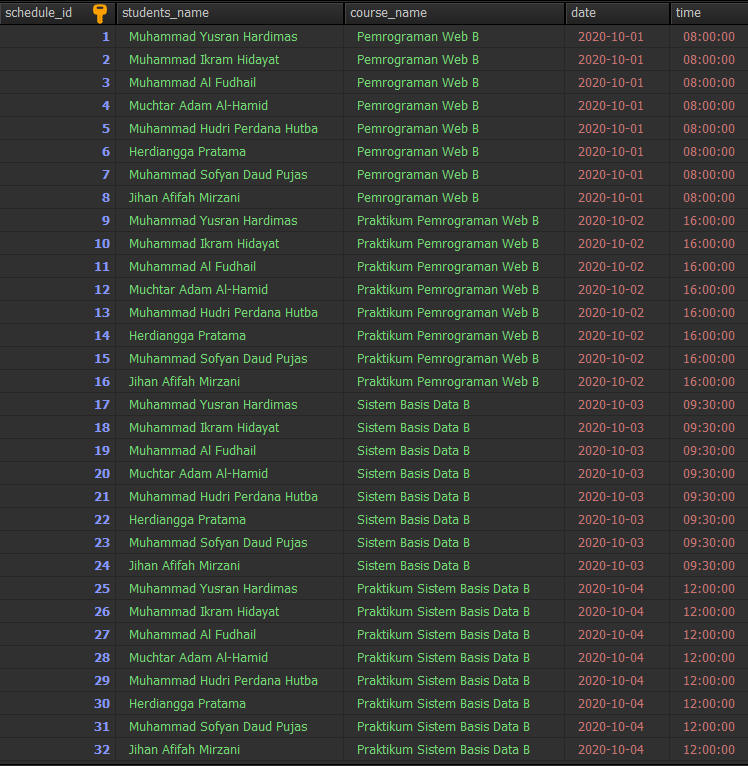

# Basis Data Kelompok II
Ini adalah repository dari kelompok 2 Basis Data I B 2022.
Kumpulan Author nya adalah sebagai berikut :
- MUHAMMAD YUSRAN HARDIMAS SETIAWAN (H071211024)
- MUHAMMAD IKRAM HIDAYAT (H071211030)
- MUHAMMAD AL FUDHAIL (H071211033)
- MUCHTAR ADAM AL-HAMID (H071211040)
- MUH HUDRI PERDANA HUTBA (H071211042)
- HERDIANGGA PRATAMA (H071211043)
- MUHAMMAD SOFYAN DAUD PUJAS (H071211045)
- JIHAN AFIFAH MIRZANI (H071211047)

# Bentuk design database Kelompok II (ERD) :


# Perintah Query Yang dipakai :
**DDL (DATA DEFINITION LANGUAGE)**
1. Membuat database baru bernama kel2_db
```
CREATE DATABASE kel2_db IF NOT EXISTS; 
USE kel2_db;
```
2. Membuat tabel students
```
CREATE TABLE students (
    students_id INT NOT NULL AUTO_INCREMENT,
    full_name VARCHAR(255) NOT NULL,
    address VARCHAR(255) NOT NULL,
    major VARCHAR(255) NOT NULL,
    PRIMARY KEY (students_id)
);
```
3. Membuat tabel courses
```
CREATE TABLE courses (
	course_id INT NOT NULL AUTO_INCREMENT,
	name VARCHAR(255) NOT NULL,
	duration INT NOT NULL,
	PRIMARY KEY (course_id)
);
```
4. Membuat tabel schedule
```
CREATE TABLE schedule (
    schedule_id INT NOT NULL AUTO_INCREMENT,
    date DATE NOT NULL,
    time TIME NOT NULL,
    students_id INT NOT NULL,
    course_id INT NOT NULL,
    PRIMARY KEY (schedule_id),
    FOREIGN KEY (students_id) REFERENCES students(students_id),
    FOREIGN KEY (course_id) REFERENCES courses(course_id)
);
desc schedule;
```

**DML (DATA MANIPULATION LANGUAGE)**
1. Mengisi Matakuliah (Sample)
```
INSERT INTO courses(NAME, duration)
VALUE   ('Pemrograman Web B', 90),
        ('Praktikum Pemrograman Web B', 120),
        ('Sistem Basis Data B', 90),
        ('Praktikum Sistem Basis Data B', 120);
```
Maka isi tabel `courses` akan menjadi seperti berikut:
<br><br><br><br>
2. Mengisi Record database students berdasarkan anggota Kelompok 2
```
INSERT INTO students (full_name, address, major)
VALUES  ('Muhammad Yusran Hardimas', 'Jl. Kebon Jeruk', 'Sistem Informasi'),
        ('Muhammad Ikram Hidayat', 'Jl. Mimpi Indah', 'Sistem Informasi'),
        ('Muhammad Al Fudhail', 'Jl. Di BTP', 'Sistem Informasi'),
        ('Muchtar Adam Al-Hamid', 'Jl. Tikus', 'Sistem Informasi'),
        ('Muhammad Hudri Perdana Hutba', 'Jl. Tamalanrea', 'Sistem Informasi'),
        ('Herdiangga Pratama', 'Jl. Seribu jalan', 'Sistem Informasi'),
        ('Muhammad Sofyan Daud Pujas', 'Jl. Air Kuning', 'Sistem Informasi'),
        ('Jihan Afifah Mirzani', 'Jl. Gigi Beruang', 'Sistem Informasi');
```
Maka isi tabel `students` akan menjadi seperti berikut:
<br><br><br><br>
3. Mengisi Record sesuai dengan jadwal yang telah ditentukan (Kasus tanggal dan waktu disamakan)
```
INSERT INTO schedule (date, time, students_id, course_id)
VALUES  ('2020-10-01', '08:00:00', 1, 1),
        ('2020-10-01', '08:00:00', 2, 1),
        ('2020-10-01', '08:00:00', 3, 1),
        ('2020-10-01', '08:00:00', 4, 1),
        ('2020-10-01', '08:00:00', 5, 1),
        ('2020-10-01', '08:00:00', 6, 1),
        ('2020-10-01', '08:00:00', 7, 1),
        ('2020-10-01', '08:00:00', 8, 1),
        ('2020-10-01', '08:00:00', 1, 2),
        ('2020-10-01', '08:00:00', 2, 2),
        ('2020-10-01', '08:00:00', 3, 2),
        ('2020-10-01', '08:00:00', 4, 2),
        ('2020-10-01', '08:00:00', 5, 2),
        ('2020-10-01', '08:00:00', 6, 2),
        ('2020-10-01', '08:00:00', 7, 2),
        ('2020-10-01', '08:00:00', 8, 2),
        ('2020-10-01', '08:00:00', 1, 3),
        ('2020-10-01', '08:00:00', 2, 3),
        ('2020-10-01', '08:00:00', 3, 3),
        ('2020-10-01', '08:00:00', 4, 3),
        ('2020-10-01', '08:00:00', 5, 3),
        ('2020-10-01', '08:00:00', 6, 3),
        ('2020-10-01', '08:00:00', 7, 3),
        ('2020-10-01', '08:00:00', 8, 3),
        ('2020-10-01', '08:00:00', 1, 4),
        ('2020-10-01', '08:00:00', 2, 4),
        ('2020-10-01', '08:00:00', 3, 4),
        ('2020-10-01', '08:00:00', 4, 4),
        ('2020-10-01', '08:00:00', 5, 4),
        ('2020-10-01', '08:00:00', 6, 4),
        ('2020-10-01', '08:00:00', 7, 4),
        ('2020-10-01', '08:00:00', 8, 4);
```
Maka isi tabel `schedule` akan menjadi seperti berikut:
<br><br><br><br>
4. Mengubah record dalam tabel schedule
```
UPDATE schedule
SET date = '2020-10-02', time = '16:00:00'
WHERE course_id = 2;

UPDATE schedule
SET date = '2020-10-03', time = '09:30:00'
WHERE course_id = 3;

UPDATE schedule
SET date = '2020-10-04', time = '12:00:00'
WHERE course_id = 4;
```
5. Mengecek isi tabel-tabelnya
```
SELECT * FROM students;
SELECT * FROM courses;
SELECT * FROM schedule;
```
_Isi tabel-tabelnya sesuai gambar yang tertera diatas_

**DCL (DATA CONTROL LANGUAGE)**
1. Memberikan hak akses kepada user bernama 'kel2'
```
GRANT ALL PRIVILEGES ON kel2_db.* TO 'kelompok2'@'localhost' IDENTIFIED BY 'kelompok2';
```

2. Apabila ingin memberikan hanya beberapa akses
```
GRANT SELECT, INSERT, UPDATE, DELETE ON kel2_db.* TO 'kelompok2'@'localhost' IDENTIFIED BY 'kelompok2';
```
3. Menghilangkan hak akses pada user tadi
```
REVOKE ALL PRIVILEGES ON kel2_db.* FROM 'kelompok2'@'localhost';
```
4. Mengunci Tabel
```
LOCK TABLES schedule WRITE;
```
5. Unlock Tabel
```
UNLOCK TABLES;
```

**Tabel Summary**
1. Membuat tabel baru
```
CREATE TABLE schedule_summary (
    schedule_id INT NOT NULL AUTO_INCREMENT,
    students_name VARCHAR(255) NOT NULL,
    course_name VARCHAR(255) NOT NULL,
    date DATE NOT NULL,
    time TIME NOT NULL,
    PRIMARY KEY (schedule_id)
);
```
2. Mengambil record dari tabel-tabel sebelumnya
```
INSERT INTO schedule_summary (students_name, course_name, date, time)
SELECT students.full_name, courses.name, schedule.date, schedule.time
FROM schedule
JOIN students ON schedule.students_id = students.students_id
JOIN courses ON schedule.course_id = courses.course_id;
```
3. Mengecek isi tabel baru
```
SELECT * FROM schedule_summary;
```
Maka tabel `schedule_summary` akan menjadi seperti berikut:
<br><br>